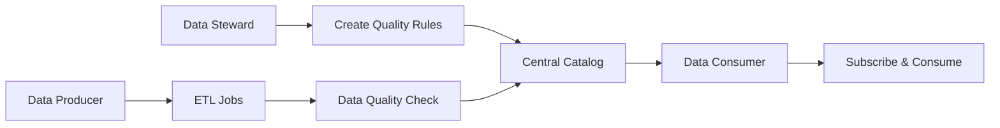

# 🔍 OpenSearch Service - Building Data Observability Platform

> **Conference Information**  
> 📅 **Date**: Tuesday, August 12, 2025 1:00 PM  
---

## 📋 Session Overview
This session focuses on building *Data Observability* in modern data platforms, addressing common challenges in data platforms and proposing solutions using OpenSearch.

---
## 🎯 Key Insights Summary

### 1. Evolution of Data Quality: Contextual Data Quality

**Limitations of Traditional Data Quality Checks**
- Rule-based validation on individual columns (e.g., age, gender validation separately)
- Lacks domain knowledge of the dataset

**New Approach: Contextual Data Quality**
- Considers correlations across multiple columns
- Example: If pregnancy flag exists, gender cannot be male
- Increasingly important in the GenAI era

### 2. Key Personas in Data Platforms

**🔧 Data Steward**
- Authors and manages data quality rules
- Possesses domain knowledge of originating systems
- Deep understanding of business context

**📊 Data Producer**
- Responsible for asset creation and ETL jobs
- Builds data pipelines and processes

**👥 Data Consumer**
- Uses data for business decisions
- Discovers and subscribes to datasets from catalogs

### 3. Data Platform Operating Workflow



### 4. Primary Failure Modes

#### 🔴 Data Drift - Silent Failure
- **Characteristics**: Jobs succeed but data exhibits abnormal changes
- **Example**: Sales units suddenly spike unexpectedly
- **Challenge**: Only detectable downstream if not monitored proactively
- **Risk**: Undetectable without proper monitoring

#### 🟡 Job Failure - Relatively Simpler
- **Characteristics**: ETL jobs themselves fail
- **Advantage**: Usually caught by existing monitoring systems
- **Causes**: Operational errors, new code deployments, etc.

### 5. Typical Incident Response Process

1. **🚨 Alert Reception** → Platform owner/Data producer
2. **🔍 Root Cause Investigation** → Identify failed metrics/tables
3. **📊 Job Tracking** → Find jobs that produced the affected table
4. **🔗 Lineage Analysis** → Understand downstream impact
5. **📝 Log Investigation** → Analyze root cause
6. **🔧 Recovery Actions** → Fix the issue
7. **✅ Platform Health Restoration**

---

## 🏗️ Observability Platform Design Principles

### 1. Centralized Metadata Management
- **Purpose**: Unified management of logs, metrics, lineage, and metadata
- **Importance**: Enable correlation across diverse toolchains
- **Lineage Role**: 
  - Visual interface for impact assessment
  - Metadata extraction for operational automation

### 2. Centralized Alert Management
- **Current Problem**: Individual alerting systems per ETL tool
- **Solution**: Unified alert management in observability platform
- **Benefit**: Decoupling observability from ETL tool capabilities

### 3. Decoupling from ETL Tools
- **Philosophy**: Remove observability features from ETL tool evaluation criteria
- **Goal**: Use the right tool for the right job
- **Requirement**: Tools only need to push metrics and logs

### 4. Adopting Open Standards
- **Benefits**: Platform extensibility and tool replacement flexibility
- **Goal**: Sustainable observability platform usage

### 5. Domain Expert-Driven Quality Management
- **Core**: Domain experts author quality rules with system knowledge
- **Goal**: More accurate and meaningful data quality checks

---

## 🎯 Ideal Observability Platform

### Consumer Experience
1. **🚨 When Incidents Occur**
   - Automatic alerts to all affected consumers
   - Specific impact information provided

2. **✅ When Incidents Resolve**  
   - Automatic resolution notifications
   - Eliminates manual verification needs

### Functional Architecture

```
[Source Systems] 
    ↓
[Ingestion Pipelines] (AWS/3rd party tools)
    ↓
┌─────────────┬─────────────┬─────────────┐
│   Storage   │   Compute   │Orchestration│
│    Layer    │    Layer    │    Layer    │
└─────────────┴─────────────┴─────────────┘
    ↓
[Business Catalog] (SageMaker)
- Data Quality, Completeness, Freshness
- Schema, Data Lineage
    ↓
[Data Observability Platform] (OpenSearch)
- Logs, Metrics, Lineage Metadata
- Dashboards, Alerts, Investigation
```

---

## 🛠️ AWS Service Mapping

| Layer | AWS Service | Role |
|-------|-------------|------|
| **Ingestion** | Various AWS/3rd party tools | Data pipeline construction |
| **Storage** | S3 | Data storage |
| **Compute** | Spark, Snowflake, Redshift | Data processing |
| **Orchestration** | Airflow, etc. | Job scheduling |
| **Catalog** | SageMaker | Metrics and lineage collection |
| **Observability** | OpenSearch | Unified observability platform |

---

## 🏢 Organizational Model Applications

### Centralized Model
- Single observability platform operation
- Enterprise-wide unified management

### Hub & Spoke Model  
- Central hub with domain-specific spokes
- Hybrid approach

### Fully Federated Model
- Independent observability solutions per domain
- Requires higher-level layer for enterprise visibility

---

## 💡 Personal Insights

### 🎯 Key Takeaways
- **Data Quality Paradigm Shift**: From simple rule-based to contextual quality
- **Operational Efficiency Focus**: Fast Red-to-Green transition is crucial
- **Tool Independence**: Separate observability from ETL tool selection criteria

### 🚀 Action Items to Explore
- [ ] Review contextual data quality checks for current data pipelines
- [ ] Research centralized alerting system implementation
- [ ] Conduct OpenSearch-based data observability platform POC
- [ ] Define and develop data steward roles

### 🤔 Additional Considerations
- **How can we automate contextual data quality rules?**
- **What are the metadata standardization approaches across diverse tools?**
- **Potential for ML models in real-time data drift detection**

---

## 🔗 Related Links

- [OpenSearch Service Official Documentation](https://docs.aws.amazon.com/opensearch-service/)
- [AWS SageMaker Data Catalog](https://docs.aws.amazon.com/sagemaker/)
- [Data Observability Best Practices](https://aws.amazon.com/big-data/data-observability/)
